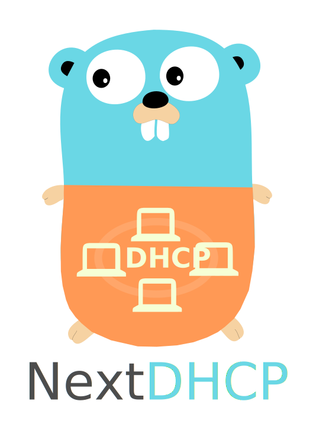

# NextDHCP



[](https://travis-ci.com/nextdhcp/nextdhcp)
[](https://codecov.io/gh/nextdhcp/nextdhcp)
[](https://goreportcard.com/report/github.com/nextdhcp/nextdhcp)
[](https://github.com/nextdhcp/nextdhcp/releases)

A DHCP server that chains middlewares. Similar to Caddy and CoreDNS

NextDHCP is an easy to use and extensible DHCP server that chains plugins. It's based on the [Caddy server framework](https://github.com/caddyserver/caddy/) and is thus similar to [Caddy](https://caddyserver.com/) and [CoreDNS](https://coredns.io/). 

<hr color="#6ad7e5">

## Getting Started

The following instructions will get you a local copy of the project for development and testing purposes. For production deployments please refer to the documentation hosted on the project website [nextdhcp.io](https://nextdhcp.io). Note that this project is still in early alpha and may not yet be considered stable.

### Prerequisites

In order to install, hack and test NextDHCP you need a working [Go](https://golang.org) environment. Since this project already adapted go modules you should use at least version 1.12. For testing it is also recommended to have
at least one virtual machine available. 

### Installing

If you just want to install NextDHCP without planning to hack around in it's source code the following command should be enough to install it

```
go get github.com/nextdhcp/nextdhcp
```

This will install the NextDHCP binary into `$GOPATH/bin`. If you want to start hacking on the project follow the steps below:

First clone the repository to a folder of your choice

```
git clone https://github.com/nextdhcp/nextdhcp
```

Finally, enter the directory and build NextDHCP

```
cd nextdhcp
go generate ./...
go build -o nextdhcp ./
```

### Usage

Before starting NextDHCP you need to create a configuration file. A typical configuration file for a local subnet can look like this:

```bash
192.168.0.100 - 192.168.0.200
lease 1h
option {
    router 192.168.0.1
    nameserver 192.168.0.1
}
```

Or, if you need to serve multiple subnets or multiple network interfaces you can also use dedicated blocks:

```
10.0.0.10 - 10.0.0.20 {
    lease 1d
}

192.168.0.1/24 {
    lease 1h
    range 192.168.0.100 192.168.0.200
    option router 192.168.0.1
    next-server 10.1.1.1
}
```

Enable monitoring 

```
10.0.0.10 - 10.0.0.20 {
    lease 1d
    prometheus {
	    address localhost:9180
        path /metrics
    }
}
```
Or 
```
10.0.0.10 - 10.0.0.20 {
    lease 1d
    prometheus localhost:9180
}
```

Place your configuration into a file called `Dhcpfile` and  start NextDHCP as root:

```
sudo ./nextdhcp 
```

For a list of supported plugins please checkout the content of the [*plugin*](./plugin) directory.

## Plugins

- [**log**](./plugin/log) - configure log output and level
- [**database**](./plugin/database) - the lease database to use. Defaults to the builtin [bbolt](https://github.com/etcd-io/bbolt)
- [**ifname**](./plugin/ifname) - sets the network interface a given subnet should be served on
- [**lease**](./plugin/lease) - configures the lease time
- [**nextserver**](./plugin/nextserver) - advertise a TFTP boot server
- [**option**](./plugin/option) - configure any DHCP options
- [**ranges**](./plugin/ranges) - lease IP addresses from pre-defined IP ranges
- [**servername**](./plugin/servername) - sets the server hostname on DHCP messages
- [**static**](./plugin/static) - lease static IP addresses to clients based on their MAC address
- [**gotify**](./plugin/gotify) - send push notifications for IP address leases and DHCP requests via gotify
- [**mqtt**](./plugin/mqtt) - extract and publish DHCP request/response information to MQTT
- [**prometheus**](./plugin/prometheus) - prometheus monitoring of request count and request time
## Versioning

We use [SemVer](http://semver.org/) for versioning. For all versions available, see the [tags on this repository](https://github.com/nextdhcp/nextdhcp/tags) or checkout the [release page](https://github.com/nextdhcp/nextdhcp/releases).

## Authors

* **Patrick Pacher** - *Initial work* - [ppacher](https://github.com/ppacher)

See also the list of [contributors](https://github.com/nextdhcp/nextdhcp/graphs/contributors) who participated in this project.

## License

This project is licensed under the MIT License - see the [LICENSE](LICENSE) file for details.

## Thank you

This project could not have been built without the following libraries or projects. They are either directly used in NextDHCP or provided a lot of inspiration for the shape of the project:

- [Caddy](https://caddyserver.com)
- [CoreDNS](https://coredns.io)
- [insomniacslk/dhcp](https://github.com/insomniacslk/dhcp)
